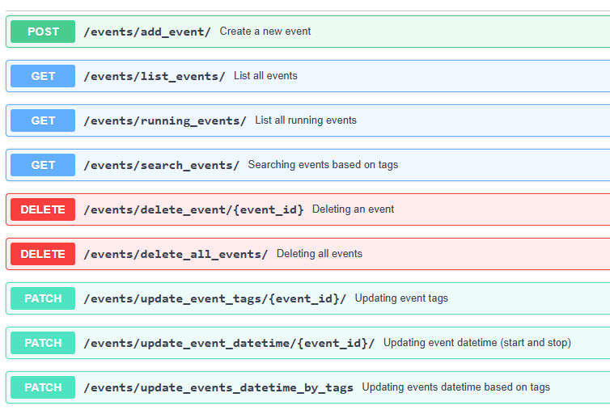

# Events management with FastAPI


##  Description

This is a FastAPI application to manage events using MongoDB database.
A docker-compose file has been added to the project, to can run the application easily in a docker container.
###  Directory Structure
```
FastApiEvents
├── app
│   ├── config
│   │   └── settings.py
│   ├── crud
│   │   └── events_crud.py
│   ├── db
│   │   └── mongodb.py
│   ├── models
│   │   └── events.py
│   ├── routes
│   │   └── events_api.py
│   ├── cli
│   │   └── events_cli.py
│   ├── __init__.py
│   └── main.py
├── tests
│   └── events_api_tests.py
├── Dockerfile
├── README.md
├── docker-compose.yaml
├── requirements.txt
└── .env
```
We can find the following files :
- settings.py : which contains the mongodb information (the database uri and database name). We use .env file to save the mongodb database information.
- mongodb.py : which contains three principal functions : one for mongodb connection creation, second to close the connection and last to get the mongodb database.
- events_crud.py : which contains the basic functions that we use to create, select, delete or update the different resources on the mongodb database.
- events_api.py : which contains the different FastApi routes.
- test_events_api.py : which contains the integration tests of our FastApi routes.
- test_unit_events.py : which contains the unit tests of our FastApi routes.
- events_cli.py : which contains the definitions of our cli commands.
- main.py : the entry point of our FastApi application.

###  API routes



##  Getting Started

Getting started developing with this template is pretty simple using docker and docker-compose.

```shell script
# Clone the repository
git clone https://github.com/zakisaoud77/events-management.git

# cd into project root
cd events-management

# Launch the project for the first time
docker-compose up --build web

# Launch the project again (for next times)
docker-compose run web
```

Afterward, the project will be live at [http://localhost:8000](http://localhost:8000).

## Documentation

FastAPI automatically generates documentation based on the specification of the endpoints you have written. You can find the technical documentation and the details of API routes at [http://localhost:8000/docs](http://localhost:5000/docs).
You can use Postman test the different routes.
For example:

- To list all events, we use the following url :

```http://localhost:8000/events/list_events/  ```

- To create new event, we use the following url :

```http://localhost:8000/events/add_event/```

Then we send the following event attribute on the request body :
```
{
  "start": <your-start-datetime>,
  "tags": [<your-tag-value>, <your-tag2-value> ....]
}
```
- To replace the tags of an event, we can use the following url :

```http://localhost:8000/events/update_event_tags/<your-event-id>/?tags=<your-tag-value>&replace=True```

## CLI
For running the CLI commands, we use also a docker container. To run a CLI command you should run a docker-compose command and specify the CLI command and its parameters.
For example :

- If you want to create new event, you should use the following command (stop is optional):

```docker-compose run --rm cli add-event --start <your-start-datetime> --stop <your-stop-datetime> --tags <tag-value> --tags <tag-value>```

- If you want to list all events, you should use the following command (skip and limit are optionals):

```docker-compose run --rm cli list-all-events --skip <your-skip-value> --limit <your-limit-value>```

- If you want to list only running events, you should use the following command (skip and limit are optionals):

```docker-compose run --rm cli list-running-events --skip <your-skip-value> --limit <your-limit-value>```

- If you want to delete an event, you should use this command (force_delete is optional):

```docker-compose run --rm cli delete-event --event_id <your-event-id> --force_delete <True|Flase>```

- If you want to search an event based on tags, you should use the following command :

```docker-compose run --rm cli search-event --tags <your-tag-value> --tags <your-tag-value>```

- If you want to update an event tags, you should use the following command :

```docker-compose run --rm cli update-event-tags --event_id <your-event-id> --tags <your-tag-value> --tags <your-tag-value>```

- If you want to replace an event tags, you should use the following command :

```docker-compose run --rm cli update-event-tags --event_id <your-event-id> --tags <your-newtag-value> --replace True```

- If you want to update an event datetime, you should use the following command :

```docker-compose run --rm cli update-event-datetime --event_id <your-event-id> --start <your-new-start> --stop <your-new-stop>```


## Testing
### Unit Tests:
You can run the unit tests by using the following command :

<pre><code> pytest .\tests\test_unit_events.py --disable-warnings</code></pre>

### Integration Tests:
The integration tests can be started using a docker container. To run the integration tests (And unit tests) and build the test docker container, you should use the following command :
<pre><code> docker-compose up --build test  </code></pre>
If you want to run the integration tests again (After creating the fastapi-test container), you can use the following command (without making the build again)
<pre><code> docker-compose run test </code></pre>


